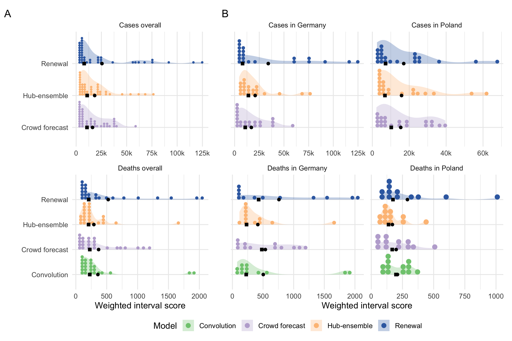
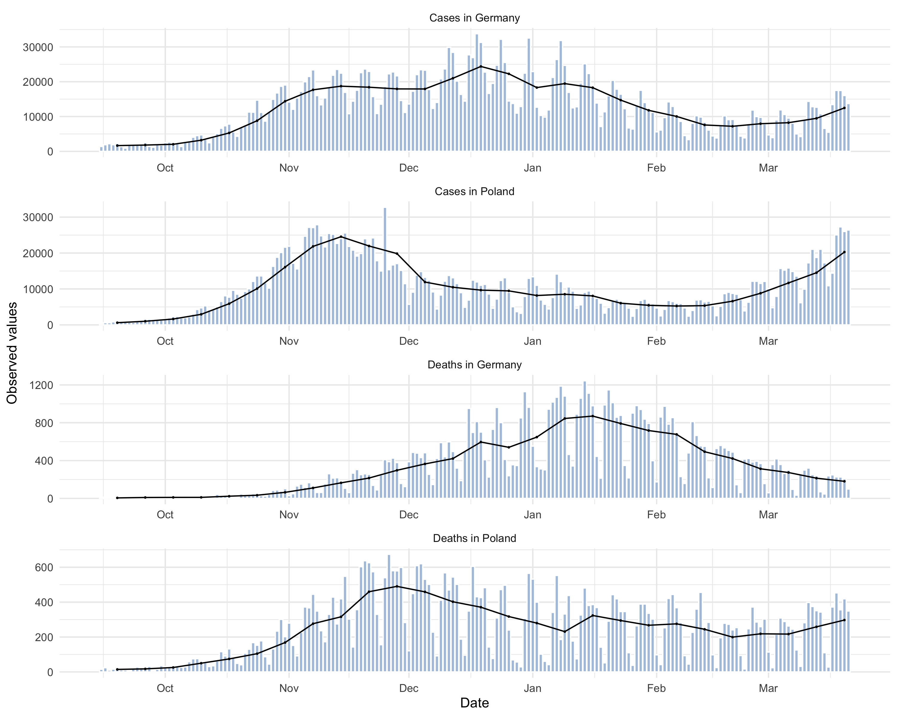
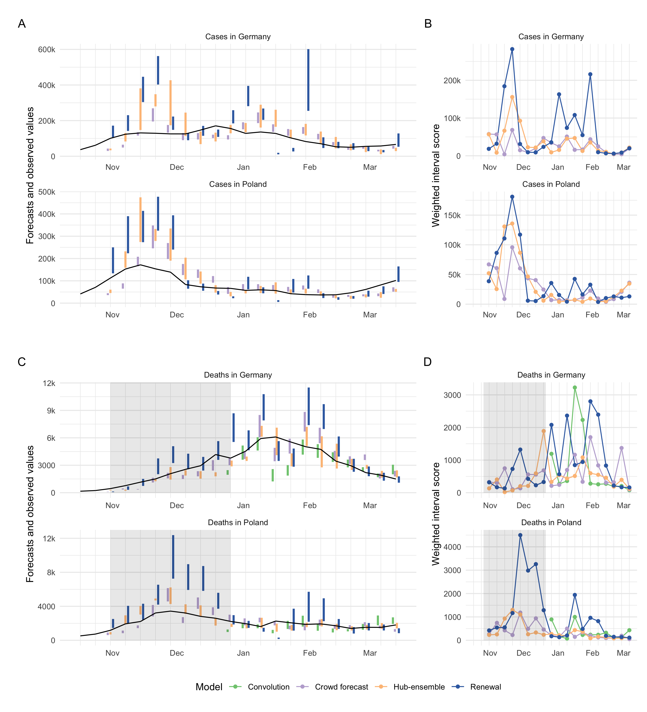
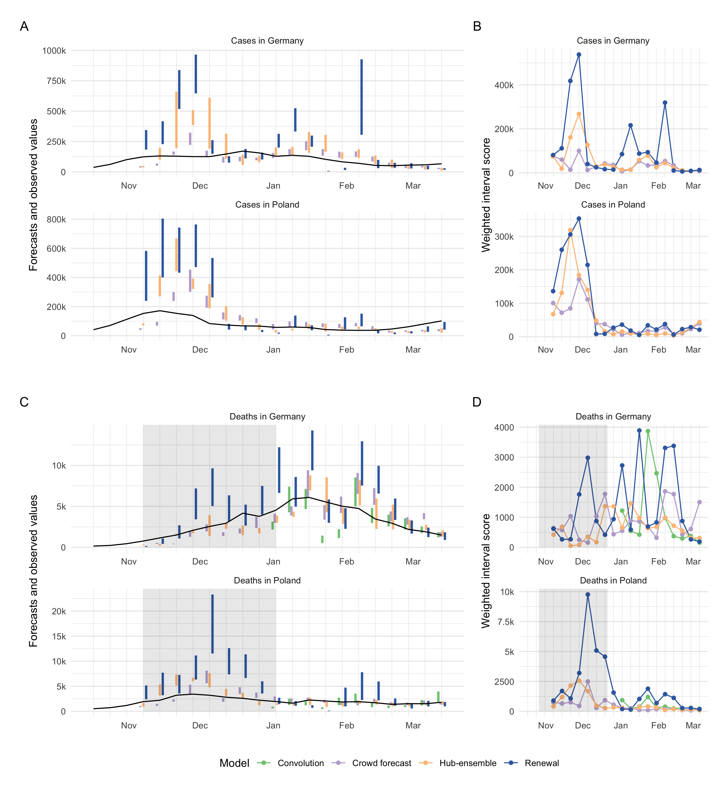
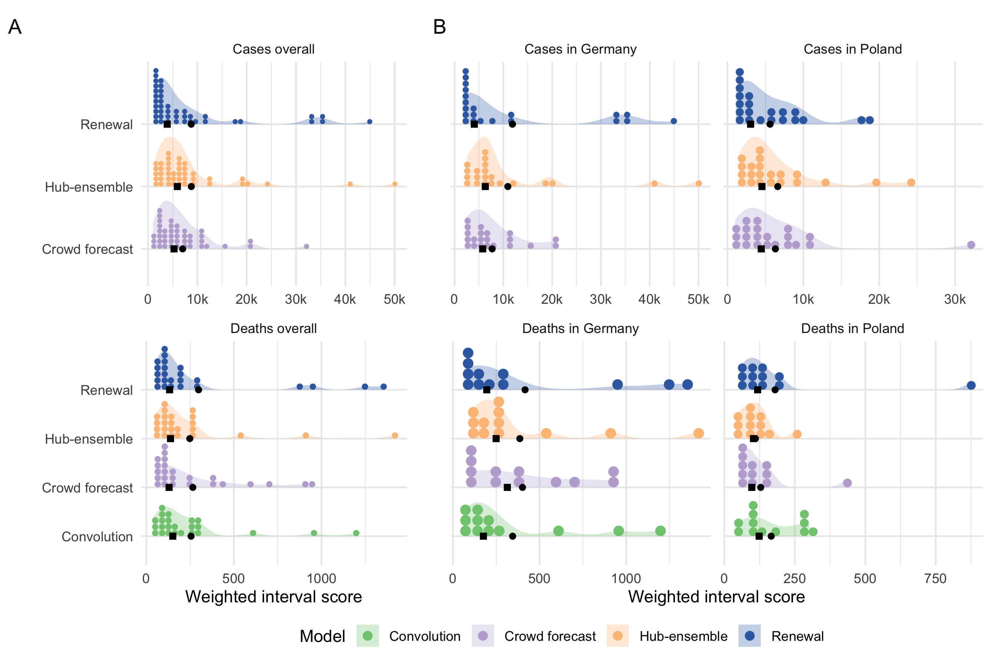
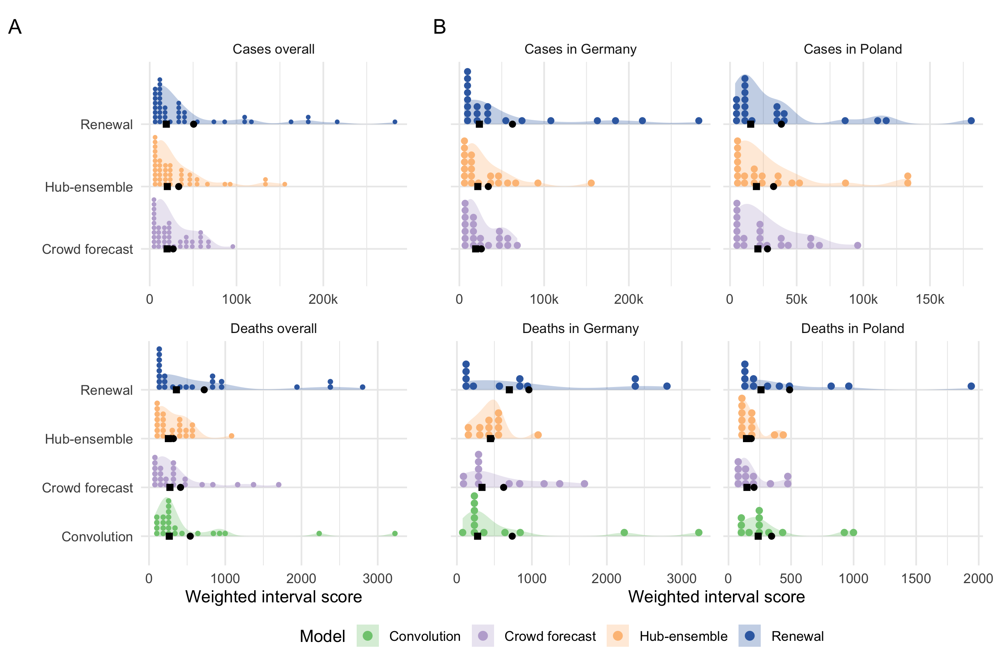

*Anonymous Alpaca and many friends*

```{r setup, include=FALSE}
knitr::opts_chunk$set(echo = FALSE, message = FALSE, warning = FALSE, 
                      out.width = "100%", 
                      fig.pos = "H", out.extra = "")
```

# Abstract (max 200 words, no subheadings)

Model-based forecasts, which have played an important role in shaping public policy throughout the Covid-19 pandemic, represent an implicit combination of model assumptions and the researcher’s subjective opinion. This work explicitly separates human opinion and model-derived insights to assess and compare the relative strengths and weaknesses of both approaches. We compared purely opinion-derived forecasts of cases and deaths from COVID-19 in Germany and Poland, elicited from researchers and volunteers (“crowd forecasts”), against predictions from two semi-mechanistic epidemiological models. In addition, we compared these forecasts against an ensemble of model-based, but expert-tuned, forecasts, submitted to the German and Polish Forecast Hub by other research institutions (“Hub ensemble”). We found an ensemble of crowd-sourced predictions to outperform all other methods when predicting cases (Weighted Interval Score relative to the Hub ensemble at a two-week horizon: 89%), but not when predicting deaths (rel. WIS 126%). Crowd forecasts were severely overconfident (55% and 75% coverage of the 95% prediction intervals for cases and deaths, respectively) when compared to model-based predictions. Performance of the untuned models deteriorated quickly with increasing forecast horizon when assumptions were no longer met (rel. WIS > 164% for all four week ahead predictions). 

# Introduction

Infectious disease forecasting has a long tradition and has helped inform public health decisions about (among others) influenza [CITATION], dengue fever [Citation], ebola [Citation], chikungunya and now COVID-19 [Citation]. The aggregation of forecasts of COVID-19 cases, hospitalisations or deaths from multiple teams has created opportunities to compare the predictive performance of different models (CITE e.g UK, US and German/Polish papers). Yet it has been difficult to discern which factors lead to good COVID-19 forecasts. Answering this question is complicated by the varying and generally unobserved degree of manual expert intervention. Model-based forecasts usually represent an implicit combination of human judgement and model-derived insights, in the sense that forecasts have been generated with the help of epidemiological or statistical models, but throughout the process were manually changed and adjusted according to the researchers’ judgement. 

Previous work has examined human predictions in various contexts, such as geopolitics (Tetlock et al. 2014; Atanasov et al. 2016), meta-science (Cite Replication Markets), and epidemiology (CITE FARROW ET AL, McAndrew et al. 2021, Cite that other paper). Several prediction platforms (Metaculus 2020, Hypermind, Foretell) and prediction markets (cite predictit) have been created to collate expert and non-expert predictions. However, with the notable exception of Farrow et al., these crowd forecasts  were not designed to be evaluated alongside model-based forecasts and usually follow their own (often binary) formats. Farrow et al. found that humans could outperform computer models at predicting the 2014/15 and 2015/16 flu season in the US, a setting where the disease was well known and information about previous seasons was available. They tended to do slightly worse at predicting the 2014/15 outbreak of chikungunya in the Americas, a disease previously largely unobserved and unknown there and then. 

In this study, we attempt to further shed light on the role of human judgement and model-based insight and analyse respective strengths and weaknesses. To compare human judgement and model-derived insights we evaluate and compare forecasts of weekly reported cases and deaths from COVID-19 in Germany and Poland made in real time over 21 weeks from October 2020 until March 2021. Specifically, we created a crowd-sourced forecast (“crowd forecast”), elicited from participants through a web application [Citation], as well as two semi-mechanistic models informed by basic assumptions about COVID-19 epidemiology. In contrast to Farrow et al., we asked participants not only for point predictions, but also for their predictive uncertainty, to exploit the greater utility of probabilistic forecasts (CITE Held, Meyer, Bracher, 2017). 

# Results

The crowd forecast was constructed as an unweighted average of submissions by individual participants. The first of the two epidemiological models, the “renewal model”, estimates the effective reproduction number Rt (the average number of people each infected person is expected to infect in turn) and models future infections as a weighted sum of past infections (i.e. active infections) times Rt (assuming Rt to stay constant in the future). Based on predicted infections, reported cases and deaths are obtained by using delay distributions to model the time between infection and report date or death. Cases and deaths were forecast completely separately, meaning that Rt was estimated once from reported cases and once from reported deaths independently, meaning that death forecasts from the renewal model were not informed by past cases. The second model (“convolution model”) was only used to forecast deaths and modeled these as a fraction of infected people who would die with some delay. Both models were left completely untuned and unchanged throughout the study period to create a baseline purely informed by epidemiological assumptions. Human forecasters, on the other hand, were able to adapt their forecasts to current or likely future interventions.


## Study period

Crowd forecasts and the renewal model were created over the whole period between October 12th 2020 until March 1st 2021. They were both submitted to the so-called German/Polish forecast hub (http ref) and thus time-stamped (with one belated submission for the renewal model on December 28). We only added the convolution model later and started submitting it on December 21st 2020. To ensure compatibility between models, all death forecasts were scored using only the period from December 14th on, whereas case forecasts were evaluated on the entire submission period. A total number of 31 participants submitted forecasts. The median number of forecasters was 6, the minimum 2 and the maximum 9 for a single forecast target. Participation rose steadily and peaked in February, before declining towards the end of the study period. The mean number of submissions from an individual forecaster was 4.7 but the median number was only one - most participants dropped out after their first submission. Only two participants submitted a forecast every single week, both of whom are authors on this study.

```{r}
caption <- "Visualisation of aggregate performance metrics across forecast horizons. A, B: mean weighted interval score (WIS, lower indicates better performance) across horizons. WIS is decomposed into its components sharpness, over-prediction and under-prediction. C: Empirical coverage of the 50\\% prediction intervals (50\\% coverage is perfect). D: Empirical coverage of the 90\\% prediction intervals. E: Sharpness (same as in panel A, B). Higher values mean greater dispersion of the forecast and imply ceteris paribus a worse score. F: Bias, i.e. general (relative) tendency to over- or underpredict. Values are between -1 (complete under-prediction) and 1 (complete over-prediction) and 0 ideally. G: Absolute error of the median forecast (lower is better). H. Standard deviation of all WIS values for different horizons"
```

```{r agg-performance-all, fig.cap=caption}
knitr::include_graphics("../analysis/plots/aggregate-performance-all-4.png")
## change name to v4
```


```{r}
caption <- "A, C: Visualisation of two week ahead forecasts against the true observed values. The shape indicates whether there has been a monotonic increase or decrease over the last two weeks leading up to a given data point, or an unclear trend. Forecasts that aren’t scored (because there was no complete set of death forecasts available) are greyed out. B, D: Visualisation of corresponding WIS. The shape indicates whether the trend was rising, falling or unclear at the date when the corresponding forecast was made (i.e. two weeks earlier, which leads to a shift of two weeks when compared to panels A and C)"
```

```{r forecasts-and-truth, fig.cap=caption}
knitr::include_graphics("../analysis/plots/figure-forecasts-2.png")
```


## Case Forecasts

For cases, crowd forecasts had a lower mean weighted interval score (WIS, lower values indicate better performance) than both the renewal model and the Hub ensemble across all forecast horizons (Figure \@ref(fig:agg-performance-all)A) and locations (Figure S1A). For two week ahead forecasts, mean WIS relative to the Hub ensemble (= 100%) was 89% for crowd forecasts and 140% for the renewal model (Table SX). Across all forecasting approaches, locations and forecast horizons, the distribution of WIS values was right-skewed, and average performance was heavily influenced by outliers (Figure 3). Overall, low variance in forecast performance was closely linked with good mean performance (Figures 1AX and 1DX), suggesting that the ability to avoid large errors was an important factor in determining overall performance. The impact of outlier values was especially pronounced for the renewal model, which had more outliers (Figure XX), as well as the highest standard deviation of WIS values (relative WIS sd 154% a the two weeks ahead horizon), while the ensemble of crowd forecasts  (rel. WIS sd 76%) and the Hub ensemble (= 100%) showed more stable performance. 

To varying degrees, all models exhibited trend-following behaviour and were rarely able to predict a change in trend before it had happened. For example, all models failed to predict the change in trend from increase to decrease that happened in early November... in Germany and severely overshot (Figure 2XX). This was most striking for the renewal model, which extrapolated unconstrained exponential growth based on the recent past  of observations. The Hub ensemble and the crowd forecast, which had both been under-predicting throughout October, also failed to predict the change in trend after cases peaked, but less severely so. Human forecasters, possibly aware of the semi-lockdown announced on November 2nd 2020 (Deutsche Welle (www.dw.com) n.d.) and the change in the testing regime (with stricter test criteria) on November 11th 2020 (Ärzteblatt 2020), were fastest to adapt to the new trend, and the Hub ensemble slowest. In December, cases rose again in Germany, with all models under-predicting this growth to varying extents. As in October, the renewal model captured the phase of exponential growth in cases slightly better than other approaches, but again overshot when reported case numbers fell over Christmas. The large variance in predictions in January in Germany (severe under-prediction followed by severe over-prediction) may in part be caused by the fact that the renewal model operated on daily data and therefore was susceptible to fluctuations in daily reporting around Christmas that would not have influenced on weekly reporting. Similar trends in performance were evident in Poland, with the crowd forecast quickest at adapting to the change in trend in November. In general, there were fewer large outlier forecasts in Poland and in particular the renewal model performed more in line with other forecasts there. 

All forecasting approaches, including the Hub ensemble, were overconfident and showed lower than nominal coverage (meaning that 50% (90%) prediction intervals generally covered less than 50% (90%) of the actually observed values) (Figure 1X and 1X). Coverage for all forecasts deteriorated with increasing forecast horizon, indicating that all forecasting approaches struggled to quantify uncertainty appropriately for case forecasts. This was especially an issue for crowd forecasts, which were markedly sharper (i.e., narrower) than other approaches (Figure 1X) and only showed a small increase in uncertainty across forecast horizons. In spite of good performance in terms of the absolute error (Figure 1X), excessive sharpness led to forecasts which were severely overconfident (covering only 36% and 55% of observations with their 50% and 90% prediction intervals at a two week horizon, and only 5% and 38% four weeks ahead) (Figure 1X and Table SXX). Despite worse performance in terms of absolute error (Figure 1X), the renewal model achieved better calibration (comparable to the Hub ensemble), as uncertainty increased rapidly and non-linearly across forecast horizons.   

The renewal model exhibited a noticeable tendency towards over-predicting reported cases across all horizons (as captured by our relative bias metric with values between -1 and 1 and 0 ideally). The crowd forecast tended to over-predict at longer forecast horizons, whereas the Hub ensemble showed no systematic bias (Figure 1X). Regardless of a general relative tendency to over-predict, all forecasting approaches incurred larger absolute penalties from over- than from under-prediction (see decomposition of the WIS into absolute penalties for over-prediction, under-prediction and dispersion in Figure X and Table X), implying that over-prediction (e.g. when missing a peak) tended to be more costly in terms of the WIS. 


## Death Forecasts

For deaths, the Hub ensemble outperformed the crowd forecasts as well as our model-based approaches across all forecast horizons and locations (Figure 1A, Figure S1A). Relative WIS values for the models two weeks ahead were 122% (convolution model), 126% (crowd forecast), 100% (Hub ensemble) and 179% (renewal model). The crowd forecasts performed better than the renewal model across all forecast horizons and locations (Figure 1A, Figure S1A), and also better than the convolution model three and four weeks ahead. Poor performance of the renewal model, especially at longer horizons, indicates that an approach that does not know about past cases, but instead estimates and projects a separate Rt trace from deaths, is not well suited for the task. The convolution model was able to outperform both the renewal model and the crowd forecasts at shorter forecast horizons (where the delay between cases and deaths means that future deaths are largely informed by present cases), but saw performance deteriorate at three and four weeks ahead (where case predictions from the renewal model were increasingly used to inform death predictions) (Figure 1A, Table SX). 

Theoretical considerations suggest that predicting a change in trend may be easier for deaths than for cases (as past cases, hospitalisations and other data can be used as predictors). Even though all forecasts generally struggled with this, there were some instances where changing trends were well captured or even anticipated. In Poland, for example, the Hub ensemble was able to capture or even anticipate the peak in deaths in December quite well (whereas the renewal model and crowd forecast did not). The renewal model, which mostly exhibited trend-following behaviour, correctly predicted another increase in weekly deaths in mid-January (potentially based on changes in daily deaths, as the renewal model did not know about past cases). In Germany in early January, all models predicted a decrease in deaths two to three weeks before it actually happened. Predictions from the renewal model at that time were likely strongly influenced by an unexpected drop in reported deaths on December XXth. The other forecasting approaches and in particular, the convolution model may have been affected by potentially under-reported case numbers around Christmas. When the decrease that all models had predicted to happen in early January failed to materialise, the renewal model and the crowd forecast noticeably over-corrected and over-predicted deaths in the following weeks, while the Hub ensemble, and to a slightly lesser degree, the convolution model were able to capture the downturn well when it finally happened at the end of January. 

Death forecasts, generally, showed greater coverage of the 50% and 90% prediction intervals than case forecasts and no decrease in coverage across forecast horizons, indicating that it might be easier to appropriately quantify uncertainty for death forecasts. The Hub ensemble had the greatest coverage, with empirical coverage of the 50% and 90% prediction intervals exceeding 50%, and 90%, respectively, across all forecast horizons. Coverage for the crowd forecasts and our model-based approaches was generally lower than that of the Hub ensemble and mostly slightly lower than nominal coverage (Figure 1X and XX). As for cases, the crowd forecast tended to be the sharpest and uncertainty increased most slowly across forecast horizons, and the renewal model forecasts generally were widest. The convolution model was relatively sharp for short forecast horizons, but had rapidly (and non-linearly) increasing uncertainty for longer forecast horizons, driven by increasing uncertainty in the underlying case forecasts. 

For deaths, the ensemble of crowd forecasts had a consistent tendency to over-predict. The convolution model had a strong tendency to under-predict, which steadily decreased for longer forecast horizons. The renewal model (which over-predicted for cases) and the Hub ensemble slightly tended towards under-prediction. For deaths, absolute over- and under-prediction penalties were more in line with a general relative tendency to over- or underpredict than for cases (Figure XX). 


```{r}
caption <- ""
```

```{r distribution-scores, fig.cap=caption}

```


## Performance across locations (maybe not a separate section or more nuance)

Generally, trends in overall performance were similar across locations (Figure S1). Notably,the convolution model performed better, when assessed by both median and mean WIS, in Germany than Poland indicating a stronger connection between observed cases and deaths. Due to the differing population sizes and numbers of notifications in Germany and Poland absolute scores were difficult to compare directly  (Figure S1).

All model-based predictions, but not the crowd forecasts, were noticeably sharper in Poland than in Germany (Figure S1), in line with their smaller overall WIS values. Crowd forecasts for cases (but not for deaths) were approximately equally sharp in Poland and in Germany. For both cases and deaths, forecasts tended to be lower relative to observed values in Poland than in Germany, with bias values lower for all forecasts in Poland than in Germany (except crowd forecasts of cases, Figure S1F). 

```{r}
caption <- "Visualisation of aggregate performance metrics across forecast horizons for the different versions of the Hub ensemble. “Hub-ensemble” excludes all our models, Hub-ensemble-all includes all of our models, “Hub-ensemble-real” is the real hub-ensemble with the renewal model and the crowd forecasts included. Values (except for Bias) are computed as differences to the Hub ensemble excluding our contributions. For Coverage, this is an absolute difference, for other metrics this is a percentage difference. A: mean weighted interval score (WIS) across horizons. B: median WIS. C: Absolute error of the median forecast. D: Standard deviation of the WIS. E: Sharpness (higher values mean greater dispersion of the forecast). F: Bias, i.e. general tendency to over- or underpredict. Values are between -1 (complete under-prediction) and 1 (complete over-prediction) and 0 ideally. G: Empirical coverage of the 50\\% prediction intervals. F: Empirical coverage of the 90\\% prediction intervals"
```

```{r agg-performance-ensemble, fig.cap=caption}
knitr::include_graphics("../analysis/plots/aggregate-performance-rel-ensemble-4.png")
```


## Contribution to the Forecast Hub

Of our three models, only the renewal model and the crowd forecast were included in the official Forecast Hub median ensemble (“hub-ensemble-realised”), while the convolution model was never included as it was deemed too similar to the existing renewal model, thus potentially introducing bias. Versions that included either all of our models (“hub-ensemble-with-all”) or only one of them (“hub-ensemble-with-X”) were computed retrospectively. 

For cases, our contributions (compared to the Hub ensemble without our contributions) consistently improved performance across all forecasting horizons (rel. WIS 90% two weeks ahead). Contributions from the crowd forecasts alone also were positive across all forecast horizons, while contributions from the renewal model became negative for longer horizons (rel. WIS 102% three weeks ahead, 106% four weeks ahead). The realised ensemble including both models performed better or equal compared to all versions with only one model included for up to three weeks ahead, suggesting synergistic effects. Only for four week ahead predictions would removing the renewal model have improved performance (Table XX). 

For deaths, contributions from the renewal model and crowd forecast together improved performance only for one week ahead predictions and showed an increasingly negative impact on performance for longer horizons (rel. WIS of the hub-ensemble-realised 101% two weeks ahead, 105% four weeks ahead). Individual contributions from both the renewal model and the crowd forecast were largely negative, while a version of the Hub ensemble with only the convolution model included would have performed consistently better across all forecast horizons (with the positive impact increasing for longer horizons). This is especially interesting as the convolution model performed consistently worse than the pre-existing Hub ensemble (Table XX) and especially worse for longer horizons. 

We also considered the impact of our contributions on the mean, rather than the median ensemble. General trends were similar, with the notable exception of the convolution model, which had a consistently positive impact on the median ensemble, but a mixed and mostly slightly negative impact on the mean ensemble. This may happen if a model is more correct directionally relative to the pre-existing ensemble, but overshoots in absolute terms, thereby moving the ensemble too far. For both the mean and the median ensemble, changes in performance from adding or removing models were of a similar order of magnitude, suggesting that at least in this instance, with a relatively small ensemble size, the median ensemble was not necessarily more ‘robust’ to changes than the mean ensemble. However, the ensemble version with all our forecasts included (“hub-ensemble-with-all”) tended to perform relatively better for the median ensemble than the mean ensemble, suggesting that adding more models may be more beneficial or ‘safer’ for the median than for the mean ensemble as directional errors can more easily cancel out than errors in absolute terms. 


# Discussion
Epidemiological forecasting usually represents a mix between human insight and model-based assumptions. In this study, we compared purely opinion-derived forecasts of cases and deaths from COVID-19 in Germany and Poland, elicited from a crowd of researchers and volunteers against predictions from two semi-mechanistic epidemiological models. In spite of the small number of participants and a general tendency to be overconfident, crowd forecasts consistently outperformed our epidemiological models as well as the Hub ensemble when forecasting cases but not when forecasting deaths. This suggests that humans are relatively good at foreseeing trends that are hard to model but may struggle to form an intuition for the exact relationship between cases and deaths. Our epidemiologicalUntuned models, on the other hand performed relatively well short-term, but not for longer horizons without any form of human intervention or assumption to guide behaviour when conditions evolve. Ensembles, in general, showed the greatest consistency in their performance (and best mean performance), but did often not provide the best forecasts for a given forecast date. Our contributions consistently improved the pre-existing Hub ensemble for cases, but not for deaths. We often found contributions to an ensemble to be beneficial even in instances where the forecasting approach entering the ensemble performed consistently worse than the pre-existing ensemble.  


Past studies have evaluated the performance of model-based forecasting approaches as well as human experts and non-experts in various contexts. However, most of these studies either focused only on the evaluation of (expert-tuned) model-based approaches (Cite US Hub, cite Seb SPI-M), or exclusively on human forecasts (e.g. cite Tetlock, cite Grecchia, cite McAndrew). In contrast, we directly compare human and model-based forecasts. This is similar to the approach taken by Farrow et al., but extends it in several ways. While Farrow et al. only asked for point predictions and constructed a probabilistic forecast from these, we asked participants to quantify their uncertainty directly, allowing us to compare human forecasts and models without any further assumptions, as well as to analyse aspects of the forecasts like overconfidence. In addition, we compared crowd forecasts to completely untuned models, allowing us to assess not only relative performance but also to analyse qualitative differences between human judgement and model-derived insight. In terms of interpretability of the results, exact knowledge of our two models, as well as focus on a limited set of targets and locations was a major advantage of our study compared to larger studies conducted by the Forecast Hubs (J. Bracher et al. 2021; E. Y. Cramer et al. 2021; S. Funk et al. 2020). 

The good performance of crowd forecasts we found is in line with results from Farrow et al. who also report strong performance of human predictions in past Flu challenges despite difficulties to recruit a large number of participants. The advantage of crowd forecasts we observed over untuned models is likely in part explained by the fact that we compared an ensemble of crowd forecasts with single models. However, this likely explains only part of the difference and performance relative to the Hub ensemble strongly suggests that human insight is valuable when predicting highly volatile and hard-to-predict quantities such as case numbers. Relatively good performance of our untuned models short-term, but not longer-term, suggests that model-based forecasts are helpful to extrapolate from current conditions, but require some form of human intervention or additional assumptions to inform forecasts when conditions change over time. This human intervention may be particularly important when dealing with artefacts in reporting and data anomalies (and especially when using daily, rather than weekly data). While we were not able to observe how expert opinion informed other models submitted to the Forecast Hub, conversations with the Hub organisers suggest that forecasts tended to benefit from a large degree of human intervention. Unfortunately, we were not able to test a scenario in which users were asked to alter an existing model output, rather than create a new forecast from a naive baseline, and can therefore make no conclusive statements about the direct effects of researchers tuning their models. 

Conversely, our results suggest that human intervention may be less beneficial when forecasting deaths (especially at shorter horizons, when deaths are largely dependent on already observed cases), which benefits from the ability to model the delays and exact epidemiological relationships between different leading and lagged indicators. Relatively good performance of the convolution model, especially compared to the poor performance of the renewal model on deaths (which used only deaths to estimate and predict the effective reproduction number) underlines the importance of including leading indicators such as cases as a predictor for deaths. 

Given the low number of participants in our study, it is difficult to generalise conclusions about crowd predictions to other settings. In particular, our crowd forecasting application was not developed to a high standard of user friendliness. This may have precluded interested parties from submitting forecasts. It is both conceivable that a greater number of participants would have improved forecasts, but also that a larger audience may have decreased the mean quality of predictions. Motivating forecasters to contribute regularly proved challenging, especially given that the majority of our participants were from the UK and had little connection to either Germany or Poland. In addition, lack of effective outreach played an important role, as did a lack of time and resources to design the interface in a way that is appealing enough to attract large audiences outside of academia. Using an R shiny app as an interface arguably created some limits to user experience and performance, influencing the number of participants. On the other hand, it facilitated quick development and allows us to provide our crowd forecasting tooling as an open source R package, meaning that it is available for others to use, and to further develop, in their context. 

In general, our results support the use of ensembles, rather than individual models to inform public health policies, as these provide consistently good forecasts and largely avoid particularly bad outlier forecasts. As an average, ensembles show the consensus opinion, which implies that in contrast to single models, they are not likely to reveal information, e.g. about future changes in trend, that is not in some way ‘obvious’ to the majority of forecasters. Indeed, as illustrated in Figure SXX, single models often outperform the ensemble (while also performing much worse at other times) and may therefore also play a role in informing public policy in specific circumstances alongside ensemble predictions. 

In the context of evaluating different models and the merits of human intervention, what constitutes a ‘good’ forecast very much depends on the purpose of that forecast. Policymakers may care much more about certain types of errors, (e.g. under-prediction) than others in a way not captured by the weighted interval score. Also, it is helpful to distinguish between ‘forecasts’ and ‘projections’. For example, the outperformance of  the crowd forecasts on cases and in general on longer forecast horizons is perhaps not surprising, given that humans could factor in an expectation of future changes in conditions (e.g. future policy interventions, adherence to these interventions, testing policy, and the evolution of new disease variants) while our model-based forecasts could not. However, if the aim of a forecast is to inform policy and decision making, then attempting to factor in the interventions one is meant to inform may be problematic (and conversely, arguing for or against interventions based on predictions may be difficult depending on what the forecast assumes about future interventions). In that sense, crowd forecasts can be understood as forecasts, whereas our model predictions may be better understood as projections that show what would happen in the absence of any events that could change the trend. This may pose a problem in the context of a forecast hub if teams have a different understanding about the purpose of a forecast. Projections that are meant to inform policy makers about possible scenarios may be different from forecasts meant to inform the general public, and yet again different from forecasts submitted with the goal of advancing open research and in order to allow public scrutiny and discussion about the merits of different approaches.   

Further work should explore the effects of human intervention on model-based forecasts in more detail. Model-based forecasts could be used as an input to human judgement, with researchers adjusting predictions generated by models. Tools need to be developed to facilitate this process at a larger scale. Human insight could also be used as an input to models. Such a ‘hybrid’ forecasting approach could for example ask humans to predict the trend of the effective reproduction number Rt or the doubling rate (i.e. how the epidemic evolves) into the future and use this to estimate the exact number of cases, hospitalisations or deaths this would imply. This approach seems especially promising for forecasting deaths if a model can accurately describe delay distributions and epidemiological relationships between different parameters. In light of severe overconfidence, yet good performance in terms of the absolute error, post-processing of human forecasts to adjust confidence intervals may be another promising approach. Crowd forecasting in general could benefit a lot from the availability of tools suitable to appeal to a greater audience. Given the good performance we and previous authors observed in spite of the limited resources available and the small number of participants, this seems worthwhile for researchers and policymakers to further develop and explore. 


## Methods - missing


# Supplementary information

## Further details on the semi-mechanistic forecasting models

### Renewal equation model

The model was initialised prior to the first observed data point by assuming constant exponential growth for the mean of assumed delays from infection to case report.


\begin{align}
  I_{t} &= I_0 \exp  \left(r t \right)  \\
  I_0 &\sim \mathcal{LN}(\log I_{obs}, 0.2) \\
  r &\sim \mathcal{LN}(r_{obs}, 0.2) \\
\end{align}


Where $I_{obs}$ and $r_{obs}$ are estimated form the first week of observed data. For the time window of the observed data infections were then modelled by weighting previous infections by the generation time and scaling by the instantaneous reproduction number. These infections were then convolved to cases by date ($O_t$) and cases by date of report ($D_t$) using log-normal delay distributions. This model can be defined mathematically as follows,

\begin{align}
  \log R_{t} &= \log R_{t-1} + \mathrm{GP}_t \\
  I_t &= R_t \sum_{\tau = 1}^{15} w(\tau | \mu_{w}, \sigma_{w}) I_{t - \tau} \\
  O_t &= \sum_{\tau = 0}^{15} \xi_{O}(\tau | \mu_{\xi_{O}}, \sigma_{\xi_{O}}) I_{t-\tau} \\
  D_t &= \alpha \sum_{\tau = 0}^{15} \xi_{D}(\tau | \mu_{\xi_{D}}, \sigma_{\xi_{D}}) O_{t-\tau} \\ 
  C_t &\sim \mathrm{NB}\left(\omega_{(t \mod 7)}D_t, \phi\right)
\end{align}


Where,
\begin{align}
     w &\sim \mathcal{G}(\mu_{w}, \sigma_{w}) \\
    \xi_{O} &\sim \mathcal{LN}(\mu_{\xi_{O}}, \sigma_{\xi_{O}}) \\
    \xi_{D} &\sim \mathcal{LN}(\mu_{\xi_{D}}, \sigma_{\xi_{D}}) \\
\end{align}


This model used the following priors for cases,

\begin{align}
     R_0 &\sim \mathcal{LN}(0.079, 0.18) \\
    \mu_w &\sim \mathcal{N}(3.6, 0.7) \\
    \sigma_w &\sim \mathcal{N}(3.1, 0.8) \\
    \mu_{\xi_{O}} &\sim \mathcal{N}(1.62, 0.064) \\
    \sigma_{\xi_{O}} &\sim \mathcal{N}(0.418, 0.069) \\
    \mu_{\xi_{D}} &\sim \mathcal{N}(0.614, 0.066) \\
    \sigma_{\xi_{D}} &\sim \mathcal{N}(1.51, 0.048) \\
    \alpha &\sim \mathcal{N}(0.25, 0.05) \\
    \frac{\omega}{7} &\sim \mathrm{Dirichlet}(1, 1, 1, 1, 1, 1, 1) \\
    \phi &\sim \frac{1}{\sqrt{\mathcal{N}(0, 1)}}
\end{align}

and updated the reporting process as follows when forecasting deaths,

\begin{align}
    \mu_{\xi_{D}} &\sim \mathcal{N}(2.29, 0.076) \\
    \sigma_{\xi_{D}} &\sim \mathcal{N}(0.76, 0.055) \\
    \alpha &\sim \mathcal{N}(0.005, 0.0025) \\
\end{align}

$\alpha$, $\mu$, $\sigma$, and $\phi$ were truncated to be greater than 0 and with $\xi$, and $w$ normalised to sum to 1. 

The prior for the generation time was sourced from [@generationinterval] but refit using a log-normal incubation period with a mean of 5.2 days (SD 1.1) and SD of 1.52 days (SD 1.1) with this incubation period also being used as a prior [@incubationperiod] for $\xi_{O}$. This resulted in a gamma-distributed generation time with mean 3.6 days (standard deviation (SD) 0.7), and SD of 3.1 days (SD 0.8) for all estimates. We estimated the delay between symyptom onset and case report or death required to convolve latent infections to observations by fitting an integer adjusted log-normal distribution to 10 subsampled bootstraps of a public linelist for cases in Germany from April 2020 to June 2020 with each bootstrap using 1% or 1769 samples of the available data  [@kraemer2020epidemiological; @covidregionaldata] and combining the posteriors for the mean and standard deviation of the log-normal distribution [@epinow2; @doiCovid19TemporalVariation; @EvaluatingUseReproduction; @rstan].

$GP_t$ is an approximate Hilbert space Gaussian process as defined in [@approxGP] using a Matern 3/2 kernel using a boundary factor of 1.5 and 17 basis functions (20% of the number of days used in fitting). The lengthscale of the Gaussian process was given a log-normal prior with a mean of 21 days, and a standard deviation of 7 days truncated to be greater than 3 days and less than 60 days. The magnitude of the Gaussian process was assumed be normally distributed centred at 0 with a standard deviation of 0.1.

From the forecast time horizon ($T$) and onwards the last value of the Gaussian process was used (hence $R_t$ was assumed to be fixed) and latent infections were adjusted to account for the proportion of the population that was susceptible to infection as follows,
 
\begin{equation}
    I_t = (N - I^c_{t-1}) \left(1 - \exp \left(\frac{-I'_t}{N - I^c_{T}}\right)\right),
\end{equation}

where $I^c_t = \sum_{s< t} I_s$ are cumulative infections by $t-1$ and $I'_t$ are the unadjusted infections defined above. This adjustment is based on that implemented in the `epidemia` R package (@epidemia, cite @bhatt202).


#### Convolution model

The convolution model shares the same observation model as the renewal model but rather than assuming that an observation is predicted by itself instead assumes that it is predicted entirely by another observation after some parametric delay. It can be defined mathematically as follow,

\begin{equation} 
    D_{t} \sim \mathrm{NB}\left(\omega_{(t \mod 7)} \alpha \sum_{\tau = 0}^{30} \xi(\tau | \mu, \sigma) C_{t-\tau},  \phi \right)
\end{equation}

with the following priors,

\begin{align}
    \frac{\omega}{7} &\sim \mathrm{Dirichlet}(1, 1, 1, 1, 1, 1, 1) \\
    \alpha &\sim \mathcal{N}(0.01, 0.02) \\
    \xi &\sim \mathcal{LN}(\mu, \sigma) \\
    \mu &\sim \mathcal{N}(2.5, 0.5) \\
\sigma &\sim \mathcal{N}(0.47, 0.2) \\
\phi &\sim \frac{1}{\sqrt{\mathcal{N}(0, 1)}}
\end{align}


with $\alpha$, $\mu$, $\sigma$, and $\phi$ truncated to be greater than 0 and with $\xi$ normalised such that $\sum_{\tau = 0}^{30} \xi(\tau | \mu, \sigma) = 1$. 

### Model fitting

Both models were implemented using the `EpiNow2` R package (version 1.3.3) [@epinow2]. Each forecast target was fit independently for each model using Markov-chain Monte Carlo (MCMC) in stan [@rstan]. A minimum of 4 chains were used with a warmup of 250 samples for the renewal equation-based model and 1000 samples for the convolution model. 2000 samples total post warmup were used for the renewal equation model and 4000 samples for the convolution model. Different settings were chosen for each model to optimise compute time contigent on convergence. Convergence was assessed using the R hat diagnostic [@rstan]. For the convolution model forecast the case forecast from the renewal equation model was used in place of observed cases beyond the forecast horizon using 1000 posterior samples. 12 weeks of data was used for both models though only 3 weeks of data were included in the likelihood for the convolution model.


## Tables with results of the forecast evaluation 

```{r}
caption <- ""
```

```{r score-table-2}
```


```{r}
caption <- ""
```

```{r score-table-4}
```


## Aggregate performance by location

### Performance across locations in absolute terms
```{r}
caption <- ""
```

```{r performance-locations, fig.cap=caption}
knitr::include_graphics("../analysis/plots/aggregate-performance-2-weeks-locations-all-4.png")
```


## Performance across locations in relative terms

```{r}
caption <- ""
```

```{r performance-locations-rel, fig.cap=caption}
knitr::include_graphics("../analysis/plots/aggregate-performance-2-weeks-locations-all-rel-4.png")
```


## Visualisation of daily reported cases and deaths

```{r}
caption <- ""
```

```{r daily-truth, fig.cap=caption}

```


### Visualisation of scores and forecasts 1, 3, 4 weeks ahead

```{r}
caption <- ""
```

```{r forecasts-and-truth-1, fig.cap=caption}
knitr::include_graphics("../analysis/plots/figure-forecasts-1.png")
```


```{r}
caption <- ""
```

```{r forecasts-and-truth-3, fig.cap=caption}

```


```{r}
caption <- ""
```

```{r forecasts-and-truth-4, fig.cap=caption}

```


### Distribution of scores for 1, 3, 4 week-ahead forecasts

```{r}
caption <- ""
```

```{r distribution-scores-1, fig.cap=caption}

```


```{r}
caption <- ""
```

```{r distribution-scores-3, fig.cap=caption}

```


```{r}
caption <- ""
```

```{r distribution-scores-4, fig.cap=caption}
knitr::include_graphics("../analysis/plots/distribution_scores_wis-4.png")
```


### Ranks achieved by forecasts 


```{r}
caption <- ""
```

```{r distribution-scores-ranks-1, fig.cap=caption}
knitr::include_graphics("../analysis/plots/distribution_scores_wis-1-ranks.png")
```


```{r}
caption <- ""
```

```{r distribution-scores-ranks-2, fig.cap=caption}
knitr::include_graphics("../analysis/plots/distribution_scores_wis-2-ranks.png")
```


```{r}
caption <- ""
```

```{r distribution-scores-ranks-3, fig.cap=caption}
knitr::include_graphics("../analysis/plots/distribution_scores_wis-3-ranks.png")
```


```{r}
caption <- ""
```

```{r distribution-scores-ranks-4, fig.cap=caption}
knitr::include_graphics("../analysis/plots/distribution_scores_wis-4-ranks.png")
```


## Sensitivity analysis

- tables for limited period
- plot for limited period